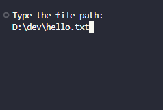

# text-editor
 This a Text Editor using C# and .NET, this aplication have a create archive text function and a open archive text.

 # Application menu

 # This a Create Archive Text function

 # After typing your text, enter the path you want to save

 # Return to menu

 # Select Open Archive Text function

 # Done! Your text is being displayed

